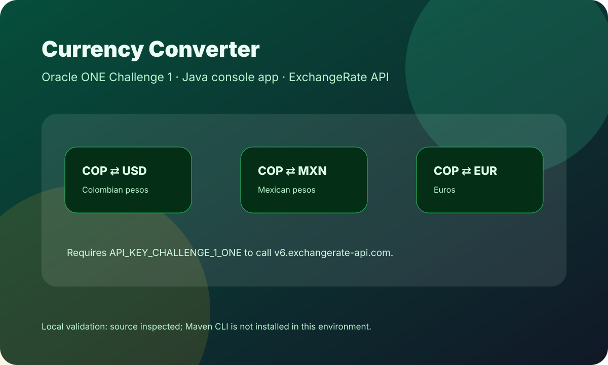

# Challenge 1 - Oracle ONE Currency Converter

Aplicación de consola en **Java 17** para convertir monedas usando **ExchangeRate API**. Corresponde al primer challenge de Oracle ONE.

<p align="center">
  
</p>

## Resumen

El programa muestra un menú en consola, solicita una opción de conversión y un monto, consume la API de ExchangeRate y muestra el resultado convertido.

## Conversiones Disponibles

```text
1. COP a USD
2. USD a COP
3. COP a MXN
4. MXN a COP
5. COP a EUR
6. EUR a COP
9. Salir
```

## Stack

- Java 17
- Maven
- Gson 2.11
- Java HttpClient
- ExchangeRate API

## Variable de Entorno

Definir la API key antes de ejecutar:

```bash
export API_KEY_CHALLENGE_1_ONE=your_exchange_rate_api_key
```

## Ejecución

Con Maven instalado:

```bash
mvn compile
mvn exec:java -Dexec.mainClass="Main"
```

También podés compilar y ejecutar desde tu IDE Java usando `Main.java` como entrada.

## Validación Local

No se pudo ejecutar Maven en esta Mac porque el comando `mvn` no está instalado en el entorno actual:

```text
command not found: mvn
```

Validación realizada:

- Se inspeccionó `pom.xml`.
- Se confirmó el flujo principal en `Main.java`.
- Se confirmó el menú de conversiones en `Menu.java`.
- Se confirmó el consumo HTTP de ExchangeRate API en `ConversorService.java`.
- Se agregó una imagen de overview al README.

## Estructura

```text
src/main/java/Main.java              # Entrada de la app
src/main/java/Menu.java              # Menú de opciones
src/main/java/ConversorService.java  # Lógica de conversión y consumo API
src/main/java/ValorConvertido.java   # Record para mapear respuesta JSON
pom.xml                              # Configuración Maven
```

## Nota

Para validar completamente necesitás Maven instalado y una API key válida de ExchangeRate API.
